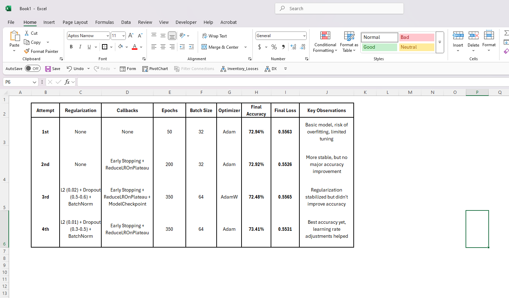

# deep-learning-challenge 

# ANALYSIS Machine Learning Tries to enhance the model over 75% 

1. Better Results This Time

Final Accuracy: Hit 73.41%, which is like, the best we’ve gotten so far.

Final Loss: Dropped to 0.5531, so it’s a tiny bit better than before.

Validation Accuracy: Way more stable than the other models we tried.

2. What We Changed to Make It Better

Regularization Stuff:

Lowered L2 regularization from 0.02 to 0.01 so it doesn’t punish the model too much.

Dialed down dropout rates to 0.3-0.5 (from 0.5-0.6) so it doesn’t lose too much info.

Learning Rate Tweaks:

Slowly dropped the learning rate so it doesn’t get stuck in bad spots.

Batch Normalization:

Used it to keep things stable and help the model learn better.

3. Stuff That Didn’t Really Change

Adam worked a little better than AdamW, probably because AdamW’s weight decay wasn’t needed with L2 already doing its thing.

The overall setup was pretty much the same as the 3rd try, just with some small tweaks that actually helped.

Final Thoughts & What to Try Next
This 4th try was the best, but the accuracy only went up by like 1%. So, maybe messing with the architecture isn’t gonna get us much further. Here’s what we could do instead:

Feature Engineering:

Get rid of or fix features that are just adding noise.

Try different scaling methods, like MinMaxScaler or StandardScaler, to see what works best.

Hyperparameter Tuning:

Use GridSearchCV or RandomizedSearchCV to find the best settings for stuff like learning rate, batch size, and L2.

Data Augmentation or Fake Data:

If the dataset is small, try oversampling (like SMOTE) to balance it out.

Try Different Models:

LSTM/GRU if we’re working with sequences, or ResNet-style stuff for deeper networks.

In the next Image you can see how was the changes thriough every try:

Resources: 

Training Machine Learning Options -  https://www.youtube.com/watch?v=29ZQ3TDGgRQ 
Group by: split-apply-combine — www.pandas.com/groupby
The Sequential model | TensorFlow Core — www.tensorflow.com/sequential_model
Pandas DataFrame.groupby() Method — www.geeksforgeeks.com/groupby
tf.keras.Sequential | TensorFlow API Docs — www.tensorflow.com/sequential_api
3 Ways to Create a Keras Model with TensorFlow 2.0 — www.pyimagesearch.com/keras_models
Keras: The High-Level API for TensorFlow — www.tensorflow.com/keras_guide
Group by and Aggregate Functions in Pandas (Documentation) — www.pandas.com/groupby_doc

By Felipe Suarez 